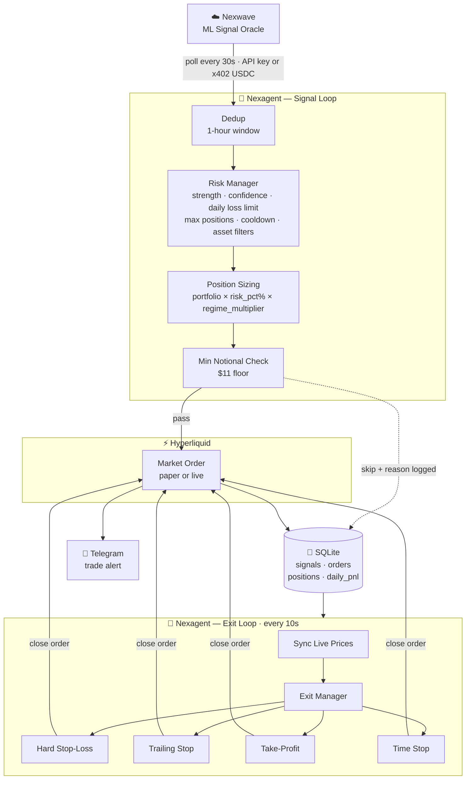

# Nexagent

**Autonomous trading agent powered by Nexwave signals.**  
**5 minutes from clone to live trades on Hyperliquid.**

Nexagent polls [Nexwave](https://nexwave.so) for ML-powered trading signals and executes trades on Hyperliquid with configurable risk rules — no database server, no broker infra, no boilerplate.

**New operator? Start here: [START_HERE.md](START_HERE.md)**

---

## What This Does

- Polls Nexwave for live trading signals (funding rate, OI divergence, volume anomaly)
- Executes trades on Hyperliquid with configurable risk rules
- Manages exits: stop-loss, trailing stop, take-profit, time-based
- Sends Telegram alerts on every trade
- Runs on Render.com for $7/month or any VPS

## Quick Start

### Deploy to Render (recommended)

1. Fork this repo
2. Connect to [Render.com](https://render.com) and create a new Web Service from your fork
3. Set environment variables in the Render dashboard (copy from `.env.example`)
4. Push to `main` → Render auto-deploys → agent starts polling signals

Total time: ~5 minutes. Cost: $7/month (Render Starter plan, always-on).

### Run Locally

```bash
git clone https://github.com/nexwave-so/nexagent
cd nexagent
pip install -e ".[alerts]"
nex init          # Interactive wizard → writes .env
nex start         # Foreground, Ctrl+C to stop
```

### Docker

```bash
docker build -t nexagent .
docker run -d --env-file .env -p 7070:7070 nexagent
```

---

## Configuration

Copy `.env.example` to `.env` and fill in your keys:

| Variable | Default | Description |
|---|---|---|
| `NEXWAVE_X402_WALLET` | — | Your Solana wallet address — funds signal payments |
| `NEXWAVE_X402_PRIVATE_KEY` | — | Solana signing key (Phantom: Settings → Export Private Key) |
| `HYPERLIQUID_WALLET_ADDRESS` | — | Your HL wallet address (0x...) |
| `HYPERLIQUID_PRIVATE_KEY` | — | Your HL private key (0x...) |
| `PAPER_TRADING` | `true` | Start in paper mode. Set `false` for live trading |
| `EXIT_MODE` | `hybrid` | `signal` \| `trailing_stop` \| `time` \| `hybrid` |
| `MAX_POSITION_USD` | `500` | Max notional per trade |
| `DAILY_LOSS_LIMIT_USD` | `200` | Agent auto-pauses when breached |
| `STOP_LOSS_PCT` | `3.0` | Hard stop: close at X% loss |
| `TRAILING_STOP_PCT` | `2.0` | Trailing stop: X% from high water mark |
| `TAKE_PROFIT_PCT` | `5.0` | Take-profit target (0 = disabled) |
| `TELEGRAM_BOT_TOKEN` | — | Optional: get from [@BotFather](https://t.me/BotFather) |

See `.env.example` for the full list.

---

## CLI Commands

```
nex start           Start agent (foreground)
nex start --daemon  Run in background
nex stop            Stop background process
nex status          Current state: positions, PnL, health
nex signals         Last 20 signals + acted_on/skip_reason
nex trades          Last 20 executed orders
nex positions       Open positions with PnL + exit levels
nex pause           Pause trading (holds positions)
nex resume          Resume after pause
nex config          Print resolved config (secrets masked)
nex init            Interactive setup wizard
nex close BTC       Market-close a specific position
nex close-all       Market-close all positions (emergency)
```

---

## How It Works



Signal types:
- **`funding_rate`** — Extreme funding rates (z-score ≥ 2σ) predict mean reversion
- **`oi_divergence`** — Price vs open interest divergence signals smart money positioning
- **`volume_anomaly`** — Abnormal volume with directional move confirms momentum

---

## API Endpoints (FastAPI)

When running, the agent exposes a status API on port 7070:

```
GET  /health      → { "ok": true, "uptime": 8142 }
GET  /status      → Full agent status JSON
GET  /signals     → Last 50 signals
GET  /trades      → Last 50 orders
GET  /positions   → Open positions with exit levels
POST /pause       → Pause trading
POST /resume      → Resume trading
POST /close/{sym} → Market-close a position
POST /close-all   → Emergency: close all
```

Set `API_KEY` env var to require `Authorization: Bearer <key>` on all endpoints except `/health`.

---

## Paper Trading

`PAPER_TRADING=true` (the default). The agent:
- Fetches real signals from Nexwave
- Simulates fills at mid price (no real orders placed)
- Tracks simulated positions and PnL in SQLite
- Runs the full exit manager against simulated positions
- Sends Telegram alerts with `[PAPER]` badge

Run paper mode for at least 48 hours before switching to live.

---

## Fully Transparent — Watch the Live Strategy On-Chain

Nexagent is open source and its trading account is public. You can verify exactly how the strategy performs before running it yourself:

**[View live trade history on Hyperliquid](https://app.hyperliquid.xyz/tradeHistory/0xf097D34D6609C6CBA55132649B99655f801A3373)**

Every entry, exit, PnL, and liquidation is permanently on-chain. The code is open, the signals are auditable, and the track record is public. No black box, no cherry-picked backtests.

---

## Get Access to Nexwave Signals

Nexagent uses **x402 pay-per-signal** — you pay micro-amounts of USDC on Solana for each signal fetch. No subscription, no API key, no monthly commitment.

1. Create a Solana wallet (e.g. [Phantom](https://phantom.app))
2. Fund it with USDC on Solana mainnet — $20–50 is a comfortable starting amount
3. Set `NEXWAVE_X402_WALLET` and `NEXWAVE_X402_PRIVATE_KEY` in `.env`

See [START_HERE.md](START_HERE.md) for full setup instructions.

Nexagent consumes two Nexwave endpoints:
- `GET /api/v1/signals` — live signals with strength/confidence scores
- `GET /api/v1/signals/regime` — market regime for position-size scaling

---

## License

MIT — see [LICENSE](LICENSE)

Built by [Nexwave](https://nexwave.so)
